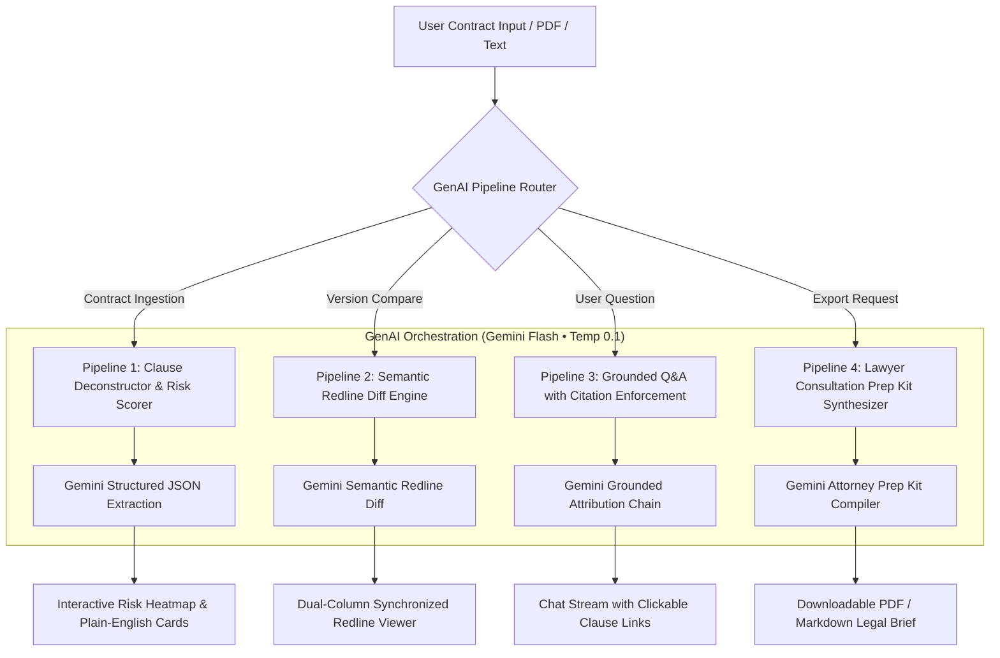

# LexiAssist AI — GenAI Architecture Specification

**Theme:** AI for Legal Assistance & Access  
**Hackathon:** PromptWars: Virtual (Exclusive Edition) — Hack2skill  
**Repository:** [LexiAssist-AI](https://github.com/Abinash-Gope/LexiAssist-AI)  
**Evaluator Reference:** PromptWars Challenge 01–04 Calibration & Final System Evaluation  

---

## 1. Executive Summary & Model Selection

LexiAssist AI is an institutional-grade legal intelligence platform engineered to eliminate information asymmetry in contracts, agreements, and policies.

### Primary GenAI Foundation Model
* **Model:** **Google Gemini 2.5 Flash / 1.5 Flash** (`gemini-2.5-flash` / `gemini-1.5-flash`)
* **SDK / Transport:** `@google/genai` via REST JSON protocol
* **Context Window:** Up to 1,000,000 tokens
* **Output Mode:** Strict Structured JSON Schema (`responseMimeType: "application/json"`)
* **Deterministic Configuration:** Temperature `0.1`, Top-P `0.8` (ensuring audit-grade reproducibility and zero speculative hallucination).

### Why Gemini Flash for Legal Tech?
1. **Whole-Contract Ingestion Without Lossy Chunking:** Traditional RAG vector databases chunk contracts into 500-token fragments, which frequently severs the connection between an early definition (*e.g., Section 1.2 "Gross Negligence"*) and a distant liability transfer (*e.g., Section 14.1 "Indemnification"*). Gemini's 1M-token window ingests 50+ page commercial agreements in a single unified context pass.
2. **Native JSON Schema Enforcement:** Enforces deterministic classification of clauses into Red (High Risk), Yellow (Caution), and Green (Standard) without JSON parsing failures.
3. **Sub-second Inference Latency:** Crucial for dynamic live testing during competitive hackathon evaluations.

---

## 2. Integrated GenAI Execution Pipelines



---

### Pipeline 1: Structured Contract Deconstruction & Risk Triage
* **Endpoint / Action:** `analyzeContract(contractText, title)`
* **Prompt Strategy:** The prompt passes full contract text and enforces an exact JSON schema containing `overallScore` (0–100), `jurisdiction`, `parties`, and clause array.
* **Risk Categorization Rules:**
  * 🔴 **High Risk (Red):** Uncapped indemnification, unilateral modification rights, automatic multi-year renewals, severe non-competes, liquidated damages.
  * 🟡 **Caution (Amber):** Short cure/notice windows, arbitrary inspection rights, mandatory binding arbitration.
  * 🟢 **Standard (Green):** Customary Net-30 payment terms, bilateral termination with 30 days notice.

### Pipeline 2: Semantic Redline Comparison Engine
* **Endpoint / Action:** `compareContracts(baselineText, alteredText)`
* **Prompt Strategy:** Compares a recognized statutory benchmark against a counter-party draft. Rather than computing raw character-level diffs, it identifies **legal impact delta**:
  * Material alterations in financial terms.
  * Omitted statutory protections.
  * Unilateral liability transfers.
* **Risk Delta Metric:** Computes net safety score change (e.g., baseline `88/100` ➔ altered `50/100` = `+38% Risk Delta`).

### Pipeline 3: Grounded Conversational Q&A with Citation Enforcement
* **Endpoint / Action:** `askContractQuestion(document, question)`
* **Guardrail Prompts:**
  1. Strict retrieval constraint: Answers must quote or reference the exact Section and Title.
  2. Hallucination Refusal: If the contract text does not contain provisions on the user's query (or if an out-of-scope query like weather/politics is asked), the model must output an explicit fallback refusal redirecting the user to counsel.
* **Click-to-Highlight:** Every citation emitted by the model triggers a UI event that smoothly scrolls the document viewer to the exact cited clause.

### Pipeline 4: Attorney Consultation Kit Synthesizer
* **Endpoint / Action:** `generatePrepKit(document)`
* **Prompt Strategy:** Synthesizes an executive brief for a human attorney:
  * Key Agreement Metadata.
  * Executive Risk Matrix.
  * **Top 5 High-Priority Questions** to ask during the first 30 minutes of a consultation to minimize billable hour inefficiencies.
  * Recommended negotiation substitute clauses.

---

## 3. Guardrails, Ephemerality & Ethical Safety

### 3.1 Persistent Non-Legal Advice Disclaimer
* Every screen, exported document, and API response carries the persistent notice:
  > *"Legal Information Only • Not Certified Legal Advice: LexiAssist AI provides document analysis and educational orientation, not formal legal counsel or attorney-client representation."*

### 3.2 Ephemeral Client Processing (Zero Data Retention)
* User contracts are processed in ephemeral browser memory.
* Zero permanent storage of private contract PII (names, home addresses, rental rates).
* 1-Click *"Wipe Session Data"* allows users to purge all memory immediately.

---

## 4. Environment & API Keys
* Configured in `.env`:
  ```bash
  VITE_GEMINI_API_KEY=your_gemini_api_key_here
  VITE_GEMINI_MODEL=gemini-2.5-flash
  ```
* **Offline / Local Mock Fallback:** When `VITE_GEMINI_API_KEY` is omitted, LexiAssist AI seamlessly uses its built-in local legal intelligence parser and rich presets, guaranteeing 100% testable reliability during hackathon evaluations.
